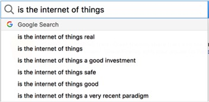

# Why is working on the Internet of Things so important? 
### Michele Thorne and Jon Rogers

_Google auto-complete of ‘is the internet of things’. Search made from Berlin in June 2017._

What is the Internet of Things (or IoT, as we affectionately call it)? How is it different from other forms of computing and what is the state of play right now? There are so many questions around IoT, and so many are skewed by a very narrow band of people. I wanted to write something that reflected my experience of IoT that was set against the collective questioning of society. So rather than pose directions myself, I let Google do the work for me… 

Is IoT real, safe, secure, a good investment, a very recent paradigm? Yes. No. No. Depends on what you mean by investment. No. 

Let’s unpick each of these. 

**_Is it real?_** 

Well, if you do a Google image search of ‘internet of things’, we know it looks like a proposal. A proposal comprising lots of nice big blue systems diagrams which very carefully tell us what the future of our homes, transport, agriculture, entertainment, cities and every aspect of our connected world will look like. The big three tech trends forecasters – Gartner[1][1](#fn1), Deloitte [2] and McKinsey [3] – all say IoT is real and that it’s worth a lot of real cash. Billions of dollars. Interesting that it’s always dollars. But I digress. Is IoT real? Until around six months ago, I would have said that the predictions of IoT are very real, but the product isn’t. However, that changed this Christmas. It changed because of voice control. IoT has found its first proper foothold into our homes. Exact figures are hard to come by, but it’s in the millions of devices. According to the BBC [4], Alexa-enabled products (Echo and Bit) have reached sales of eight million in the US (and it’s also on sale in the UK, Germany and Austria), whereas the Guardian puts it at more like 18 million [5]. This, though, is the consumer-facing window on the IoT that the tech trends forecasters want us to see. You could argue that these are self-serving prophecies, where the forecasters stand to gain by stimulating the consumption of things by the prediction of things; that if they had not predicted it, it might not have happened. A tautology that perhaps I should leave for another day.  

What I want to talk about is the reality of the IoT on our culture. It’s one thing for something to be real because it’s in our homes. But it’s another when the reality hits home in painful ways. This is where, for me, the interesting answers to ‘Is it real?’ start to come into play. The murder case of the Arkansas resident James Andrew Bates [6] is a reality check for how IoT will play out in the future. He has been accused of murder. The US police requested Amazon to release the data from his Amazon Alexa account. They refused. However, the accused has now given permission for the police to use his data [7]. What is interesting is not just the use of the voice data, but also the use of his ‘smart’ home devices in general. Much less detail is given, but surely the smoking gun of the case is the exceptional use of water between the hours of 1am and 3am that police were able to ascertain from his smart water meter?     

It reads like a narrative from a CSI or Black Mirror episode. But it’s not fiction. IoT is real. But is it safe? 

**_Is the Internet of Things safe?_** 
(and the next question: Is the Internet of Things secure?)  

Safety is contextual. The answer is complicated and contextual. There are increasing examples of the potential for insecure IoT to cause serious harm or even death, as was recently shown by researchers who proved that the ten leading brands of pacemaker could be hacked remotely to cause loss of life [8]. Driverless cars have similarly been shown to be able to be remotely controlled – the most recent example is from an ex-Uber, ex-NSA security expert who states, “Autonomous vehicles are at the apex of all the terrible things that can go wrong” [9]. These are currently theoretical problems. They’ve not become practical problems yet; problems that are being faced by other commercial IoT products. 

Children’s toys have started to get a lot of attention from security leaks. Cloud Pets (“A message you can hug”) sell an internet-connected toy for enabling children to send each other voice messages through a soft toy. The Guardian revealed, in February 2017, that from its database containing more than 800,000 children’s messages, their emails and passwords had been hacked [10]. This is something that Cloud Pets continues to deny: “Contrary to the claims being made by some articles and blog posts, the affected database contained no Cloud Pets recordings or messages” [11]. All clear? Good. Er, hold on. If you read down two lines, you’ll see this further clarification: “The exception would be accounts owned by a small minority of users who used very simple passwords, easily-guessed passwords, or who may have re-used passwords that could have been stolen as part of a data breach from another application or website”. So they have been hacked, but it’s all the fault of the users.

This sense that it is not their responsibility is echoed in Facebook’s response to the posting of a video of the horrific murder of a seventy-four-year-old man in the US by the murderer: “We need to do better”, said Justin Osofsky, Facebook’s VP of global operations. “We need to do better” is akin to the ubiquitous school report “must try harder”[11]. As if it’s a trivial matter. There’s an arrogance coming from Silicon Valley right now that’s no different from cigarette companies denying responsibility for smoking and for gun companies denying gun crime. The blame lies somewhere, but not with them. Perhaps it’s the user’s fault.   My university (rightly) doesn’t trust its staff to make the necessary security updates to protect its students from lost laptops and hacked systems. It makes sure they do it for us. That’s the responsible approach of a responsible IT department. Can the same be said for tech companies that sell us the insecure IoT which enables our children to connect? And it’s not just about kids’ toys. If you want to get really up close and personal, then look no further than sex toys. So it seems that the IoT could be safe, if only people used it safely… and understood the complexities of global internet security protocols, as well as how to routinely process the necessary updates and security administration. We all need to become system administrators of our household items – can you be bothered with that? I know I can’t.  

**_Is the Internet of Things a good investment?_**

What does it mean to invest in something? The Google search will reveal a long list of search responses that provide you with insights on whether IoT is a good financial investment. You’ll be able to read about patents, about its expected value in 2020, about the top five companies to watch. But it’s hard to find investment beyond financial. What about it being a positive thing for society? Is it good to have computation amplified and empowered in this way? Should we invest time in learning about this emerging technology? If so, how would we do this? I’ve never been very good with money, but I’m pretty sure that I am with people. It’s people that I care about. So will IoT be a good investment? I think that we’ve got it wrong. Compare the work that Vladan Joler is doing to expose the real cost behind our digital products and services to the work that Babitha George has uncovered with a village that is attempting to live a ‘Gandhian dream’. Valdan exposes some truly awful effects which highlight the lack of responsibility from tech companies.   Babitha discovers a village that builds a sustainable business by asking its people what it would take for them to stay and work there; that if you follow a Gandhian approach, you will be building an investment in people. If you invest only in the financial elements, the consequences of the investment for the majority of people are potentially dire. I think there needs to be a radical re-think in the way we view investment. We should be investing time in raising the skill and understanding of the IoT in our cities before we launch the Smart City programmes; we should be investing in ways to incentivise the repair of IoT in a way which is akin to Sweden incentivising the repair of household items [13]; we should be investing in the skills to do this.  

**_Is the Internet of Things a very recent paradigm?_** 

Well, that’s a great question, Googlebots! Not such great answers, though. I’ve been talking about how it’s not a new concept. Certainly, science fiction authors have been exploring it for over a century. My first encounter with the notion of IoT was during my English Literature classes of the ’80s. We were given E.M. Forster’s short story, ‘When the machine stops’, and I was hooked! It remains a powerful prophecy of humankind’s reliance on technologies – on the wonder it can produce, but also the dangers of what happens when it stops. I recently closed all of my social media accounts [14] (for me that meant closing LinkedIn and Twitter) and created my own little version of ‘when the machine stops’. Thankfully, it was all rather undramatic! 

“Cannot you see, cannot all you lecturers see, that it is we that are dying, and that down here the only thing that really lives is the Machine? We created the Machine, to do our will, but we cannot make it do our will now. It has robbed us of the sense of space and of the sense of touch, it has blurred every human relation and narrowed down love to a carnal act, it has paralyzed our bodies and our wills, and now it compels us to worship it. The Machine develops – but not on our lines. The Machine proceeds – but not to our goal. We only exist as the blood corpuscles that course through its arteries, and if it could work without us, it would let us die.” (E. M. Forster, The Machine Stops) 

It was the only science fiction that E. M. Forster wrote, yet it gives a haunting, writer’s viewpoint on the future we’re potentially walking into. Historians will, of course, give much earlier examples. Tom Standage’s The Victorian Internet [15] is a vivid new lens on old technologies and their remarkable similarity to today’s tech. Later in this publication, our dear friend and digital humanities professor, Andrew Prescott, suggests parallels with medieval society. So is it a very recent paradigm? Absolutely not! Not even close. 

**_Is the Internet of Things good?_**

I’ve saved this one for last. Is the Internet of Things good? Good for what? Good for whom? I’m just back from an event in NYC where I heard Matt Mitchell [16] – one of Mozilla’s Open Web Fellows [17] – say that if he could go back in time and eradicate anything, he would eradicate IoT; he would like to feed it to a monster; that it was of no use to anyone and dangerous to all. He’s an expert in crypto technologies and talked about how people have no interest in learning the skills required to make your IoT secure. “People can’t be trusted to eat healthily, so how can they be trusted to make their IoT secure? If we shut people out of their router if they didn’t do the necessary updates, then we might stand a chance”.   

In 2016, James Clapper, the US director of national intelligence, said: 

“In the future, intelligence services might use the [Internet of Things] for identification, surveillance, monitoring, location tracking, and targeting for recruitment, or to gain access to networks or user credentials”. [18]

It now looks like that was a false statement. As the Vault 7 Wiki Leaks in March 2017 now shows the extent to which the CIA and British intelligence agencies engineered ways to use IoT as mass surveillance devices in people’s homes [19].  This included Samsung Smart TVs, IoS and Android smartphones, Windows and Linux PCs, and also the potential for onboard computers in cars [20]. 

This makes Matt’s statement about going back in time and eradicating the idea of the IoT ever more convincing! But I also think there is the potential for good, and this is something I want to advocate. It’s all too easy to say we should turn back the technological clock or move to the hills. But this is neither practical nor possible. Instead, we need to pursue the goal of responsible IoT that fosters a healthy  internet. SafeMast [20], the open-source hardware project which enabled people to make their own Geiger counters, was hugely empowering to residents of Fukushima in 2011. Projects such as Smart Citizen from the IAAC [21] in Spain are exploring citizen empowerment with communities through grassroots IoT. Public Lab [22] in the US is harnessing IoT to investigate environmental concerns. The Good Home project [23] is prototyping and researching how responsible and open IoT can show up in our homes. There are many more potentially incredible applications that will use data science to amplify healthcare, connecting lonely people, finding lost pets, learning languages, protecting endangered animals and providing community resilience. When I look at these as applications, I don’t feel that any of the big IoT developers (Google, Amazon and Apple) are, in any way, doing anything to support this space. They are looking to capitalise purely on consumerism and entertainment. Things are not looking good when we look at the responsibility of US corporations and their approach to the IoT. So… is the Internet of Things good? Yes, it could be. But there’s a serious danger of it being another tool for mass surveillance, consumerism and corporate control. 

**References:**

<ol>
<li id="fn1">http://www.gartner.com/technology/research/top-10-technology-trends/<a href="#fnref1">↩</a>
</li>
2.	https://www2.deloitte.com/us/en/pages/technology/articles/technology-consulting-tech-trends-collection.html
3.	http://www.mckinsey.com/industries/high-tech/our-insights/ten-it-enabled-business-trends-for-the-decade-ahead
4.	http://www.bbc.com/news/technology-39589233
5.	https://www.theguardian.com/technology/2017/jan/22/home-battleground-amazon-google-voice-technology
6.	https://www.theguardian.com/technology/2016/dec/28/amazon-refuses-to-let-police-access-suspects-echo-recordings
7.	https://www.theguardian.com/technology/2017/mar/07/murder-james-bates-defendant-echo-recordings-amazon
8.	Marin, E., Singelée, Garcia, F., Chothia, T., Willems, R. and Preneel, B. (2016)  On the (in)security of the Latest Generation Implantable, Cardiac Defibrillators and How to Secure Them, ACSAC '16 Proceedings of the 32nd Annual Conference on Computer Security Applications, P226-236 
9.	https://www.wired.com/2017/04/ubers-former-top-hacker-securing-autonomous-cars-really-hard-problem/
10.	https://www.theguardian.com/technology/2017/feb/28/cloudpets-data-breach-leaks-details-of-500000-children-and-adults
11.	https://cloudpets.zendesk.com/hc/en-us/articles/115003696948-CloudPets-Data-Breach-FAQs 
12.	https://www.theguardian.com/commentisfree/2017/apr/19/facebook-cleveland-killing-media-host-legal-protections
13.	https://www.theguardian.com/world/2016/sep/19/waste-not-want-not-sweden-tax-breaks-repairs
14.	http://productresearch.dundee.ac.uk/?p=1664
15.	Standage, T. (2014) The Victorian Internet: The Remarkable Story of the Telegraph and the Nineteenth Century’s On-Line Pioneers, 2nd edition, Bloomsbury. 
16.	https://about.me/geminiimatt
17.	https://advocacy.mozilla.org/en-US/open-web-fellows/fellows2016
18.	https://www.theguardian.com/technology/2016/feb/09/internet-of-things-smart-home-devices-government-surveillance-james-clapper
19.	https://www.theguardian.com/media/2017/mar/07/wikileaks-publishes-biggest-ever-leak-of-secret-cia-documents-hacking-surveillance
20.	https://www.theguardian.com/technology/2017/mar/08/wikileaks-vault-7-cia-documents-hacked-what-you-need-to-know
21.	http://blog.safecast.org/
22.	https://smartcitizen.me/
23.	https://publiclab.org/
24.	http://thegoodhome.org/

