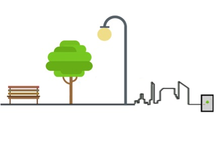

# Hack the city!

**_The challenge of the Smart city…._**
Our cities are embedded and experienced through a range of technologies; from the smartphones in our hands to traffic sensors in the roads and CCTV systems in our parks and shops. Smart cities are places where technology is combined with infrastructure, architecture, everyday objects, and even humans to respond to social, economic, and environmental problems. Yet much of the smart city remains hidden and inaccessible to its inhabitants and tends to focus on solutions to be applied top-down, and therefore, often is not open to all. Where it does support citizen’s participation and engagement, It often does not provide the appropriate tools for people and communities to make informed decisions relevant to their everyday lives.
The challenge therefore is to look at who would best contribute to the shaping of the smart city and to understand how they can do this. 

**_Opening up the smart city…_**
The smart city has the potential to enable different modes of citizenship or governance. One potential benefit is that it enables new models of governance and participation, such as crowdsourcing and ‘hacking’ where citizens create, adapt and exploit data outside of traditional city management structures. Increasingly cities have sought to play ‘catch-up’ with these alternative modes of participation by adopting ‘open data’ programmes and organizing ‘hackathons’ which encourage software developers to propose new applications for data in the city. Hacking has become a more widely used term that refers to the process of clever or playful appropriation of existing technologies or infrastructures, and reframing of the operation of a particular system beyond its intended purposes to benefit personal or communal goals. 

**_Hacking the smart city…._**
If we are to create, inhabit and change cities through technologies then we need to be doing it better and involving more people. The first point of call should be our kids. They are the generation who have grown up with the internet and have built amazing cities in minecraft, run through the streets searching for Pokestops in AR Pokemon Go and learnt how to code in Scratch at school. We need to find more and better ways for them to hack the smart city. To do this we propose that cities need to be able to talk back to us, to allow us to play with them and to enable our kids to make choices. They will Hack the City.

**_What are we doing?_**
At the Digital Design Weekeend 2017 we will run a workshop aimed at kids with their families. We will explore how simple code can connect us with everyday things in the city. The fun, hands-on learning experience will use some basic electronics connected via smartphones to test out new ways for kids to connect with the world around them. The aims of the ‘Hack the City’ workshop are:
+ To introduce to children that they can interact directly with the city around them. 
+ To show that digital code is not separate from nature/urban spaces and that computing can be ‘city-friendly’, and can easily be about connecting with everyday space and things.
+ At the end the children should have had their eyes opened to seeing the city and digital code as about potential for a whole range of interactions. 

To achieve this we will have three elements of the smart city that can be simply hacked:
1.	Talk to a tree
Citizens can view data about air pollution live in the city streets and understand the impact this has on the natural environment. This can encourage them to choose how to act on it by changing their behaviour.
Interaction: Air quality sensors linked to plant moisture sensors where the data is displayed on an AR interface. Kids will learn how to adjust the conditions of the plant depending on the air quality and humidity.

2.	Chat to a bench 
People’s emotions are increasingly mapped by social media feeds, and these can be used to influence behaviour in real-time. So a city becomes a lived shared experience and stressful situations can be identified and acted upon by changing city places or services.
Interaction: A sentiment feed from social media is mapped on to colour change within the bench, so that the emotions of the city are displayed in real time. Kids will learn how to connect their social media expressions with others to work together.

3.	Tinker with a Streetlight
Lamps and streetlights are also monitoring behaviour of the people in the city and using this data to detect either positive or negative behaviours which are linked to how city services are deployed (from managing crowds to policing crime).
Interaction: A lamp with facial recognition reacts to facial expressions by turning the light off if you scowl, and on if you smile. Kids will learn how to hack the light by using face paint to conceal their features. 

**Organisers:** OPEN city network, Plymouth University and ODI Devon/Thingscamp
This workshop develops out of the AHRC Whose Right to the Smart City Network (www.whosesmartcity.net)
