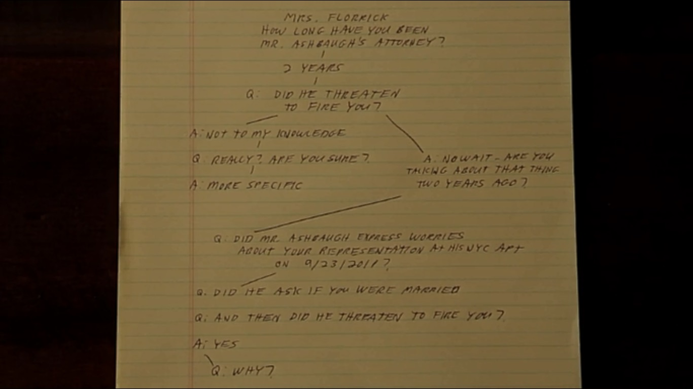
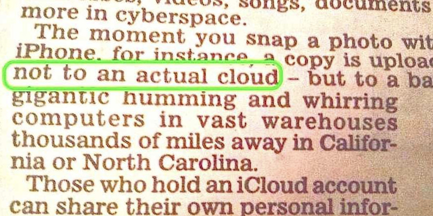
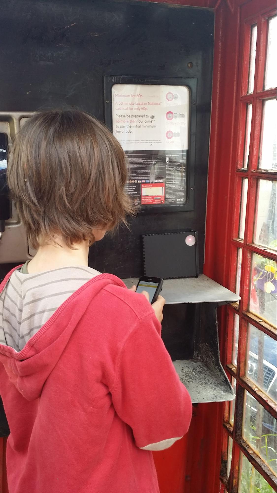
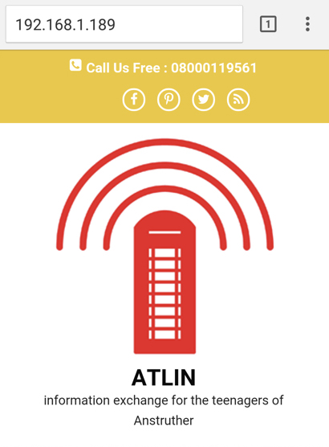
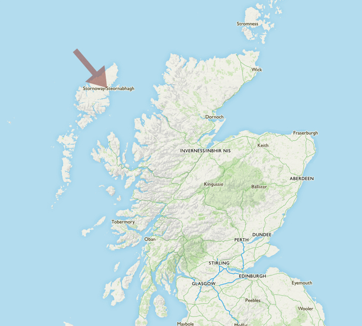

# Rethinking Decentralisation

#### Rachel Ryans

In late 2016 was invited my Mozilla’s OpenIOT Studio to think about Decentralisation, particularly in rural environments.
But first let’s start from the basics…

**_Who I am and what I’m interested in_**

I’m a creative technologist. I come from an arts background, I’m self taught techie who has always been interested in how things work. I’m a really good google-until-I-find-the-solution maker.I believe anyone can make things with the right guides and enough confidence.
I worked within a technology charity over 3 years. Within this role I got to travel the world attending conferences and festivals where people discussed new technology and the power of making. I also designed and ran workshops, outreach and longer form educational programmes. I returned to the freelance world in 2016 to have the opportunity to take part in projects like this one.
I also make tech with The Pi Hut, particularly focusing on making add-on boards for people new to making. Our aim is for our boards to do one thing well.

Before all this I ran a Arts and Tech venue in Norwich called Soup Lab.
Some things I’m generally interested in right now:
+ a friendly framework/language to talk about IoT with non-techies
+ making IoT things with non-techies
+ why/how/is the internet important to people with low/no connectivity
+ does IoT widen the divide between those with good connectivity and those without (if so, how do we deal with this?)

Why? Because if we want to make tech for everyone, then we need to include them in the progress.

**_Talking about IoT & decentralisation_**

Within this project I will be discussing IoT and decentralisation with people who have no experience of making technology, and perhaps little experience using it. Before embarking on any project that involves participants of different skills and backgrounds it’s useful to reflect on the language we use. Using too much technical jargon in the initial stages of the discussion is a sure-fire way of alienating half your new team. We want to build confidence and skills, so we don’t want to dumb down the discussion, but with a little time and effort we can develop a narrative that leaves everyone feeling like they know what’s actually being discussed.
Sidenote: it can also help your technically skilled members of the team be reminded that we are talking about how the technology affects people, rather than the technology itself. Impact rather than solutions.

**_How I develop a narrative within a workshop/discussion._**
Have you watched the The Good Wife? Check out Decision Tree. The characters are trying to predict how their opponent (each other) will question/answer in court.

 

No-one is trying to trick the other into admitting something in our situation, but running what questions might be asked and how you answer them; a balance of giving enough information and context whilst staying on topic and within time constraints is an important skill in managing the narrative within a workshop.
I also think a nice big mental bank of examples is really useful. Try and tailor your examples to the crowd you are talking to - Children and teenagers don’t care much about saving money on their central heating.
So let’s give it a go with IoT. First to introduce what the Internet of Things is…

+ The Internet of things (IoT) is the inter-networking of physical devices … embedded with electronics, software, sensors, actuators, and network connectivity which enable these objects to collect and exchange data.
Internet of things, https://en.wikipedia.org/w/index.php?title=Internet_of_things&oldid=781813467 (last visited May 23, 2017).
Makes sense to me, but would be difficult to explain to my grandma. How about we start with…

Me: IoT is made up of computers that talk to each other.

Group: Why would they need to?

M: They can exchange information. They can use that information to make better decisions in whatever they are doing. E.G. if my central heating knows I’m on holiday or late at the office, it can save energy by not turning on until I return.

G: How does the computer know I’m on holiday or late?

M: These computers generally have inputs and outputs.An input might be a sensor (it might be able to sense the temperature, or light levels, or pollution in the air) or an input might be information from the internet (like the weather forecast) or information on your phone (like your GPS coordinates).An output can be almost anything. It can control relays (which act as an on/off switch for any device - like a boiler or a fan or a smoke machine!). The output might be light (a display panel or an LED light) or sound (an annoying buzzer or a song).
So in this example your phone uses it’s GPS sensor to collect your location data, then sends this information through your data plan to a computer in your home on the WIFI. That computer takes that information and runs some code that says “I expect Rachel to be home by 6, but her phone says she is in Hawaii, so I wont turn on my relay controlling the boiler until her phone tells me she is close by.”

_This is usually when participants feel confident enough to start to think about useful inputs and outputs for themselves._

This is a very simple example, but I hope it goes some way in showing how we can start discussions about what IoT is with absolutely anyone.So, the tech savvy among you will notice I left out part of the data’s journey in the example above. Rather than my phone talking directly to the computer in my home, it actually talks to a central server in the cloud owned by a company that made my boiler’s relay (in fact the software system may be owned by a different company, the data might pass through several companies servers before it reaches the hardware). 

_Daily Mail, September 2014._

This is described as a centralised system, because rather than data going from one device directly to another, it all gets beamed up to a central system to be processed and either collected or acted upon.
I’ll talk a bit more about why this is important in the next section.

**Decentralisation**

When we discuss decentralisation within IoT, we’re often talking about:
+ Advocating for an alternative to all IoT services being managed by a few big companies.
+ Security and data ownership.
+ Local networks.

These concerns interweave, but I attempt to tease them out. It’s worth noting these are issues that are still hotly debated about the world wide web, let alone IoT, a much younger technology. I certainly don’t claim to have any definitive solutions, but let’s examine these issues a little closer.
All IoT services run by a few big companies. So, why would this be a problem? Well..
+ Lack of transparency. Everyone has experienced (i.e. ignored and accepted) the terms and conditions on services we use. Even when you do read them, it’s often technical and legal jargon making it unclear what these companies actually do with your information.
+ If the service is down you may be left without the use of vital services in your home.
Redundant hardware. If the company goes out or business or is sold, or a even just the product discontinued you may end up with hardware that no longer functions correctly.
+ Brand lock-in. These companies may make hardware that will only talk with other products made by them.
+ You need to be connected to the World Wide Web.

For balance, some advantages big companies have:
+Security, you would hope they would have the money and expertise to make sure your data is safe. More on this later.
+ Money for product innovation.
+ Money for advertising and public education.

Often people will understandably feel that they have no choice but choose products made by the big companies. However, when we spend money or time, we are not only buying a product, but we are supporting a company. We can ask companies to change products and practices, and we can stop buying from them if they don’t.

I invite people to think about seed banks (bare with me). In the last 50 years crop diversity has massively diminished, genetic diversity within each crop (fewer strains) and the number of different species grown. All over the globe we have facilities where every strain of seed is carefully stored. We store them because if a virus, disease or climate change were to wipe out a particular species of crop, then we have an alternative strain we can try. But in the meantime we would face unimaginable food shortages. We should promote diversity in our crops, because circumstances do change.

Within the IoT ecosystem we may head towards a similar situation. Where a few major companies control the majority of the IoT in our homes and cities. Unfortunately there is no seed bank equivalent for IoT services, we can’t just germinate another if ours catastrophically fail (through virus, human error, natural disaster, ?). So we must make sure we support a wide range of companies now. Diversity is important.
To push the analogy a little further, decentralised systems quarantine themselves from some of this threats. If you are not online, then someone would have to come and physically interfere with your system, which is much less likely.

**Security**

I will be brief, because there is so much information out there on the WWW about IoT security failures. Imagine for a moment, if every minute detail of your daily life - when you turned the light out to go to bed, when you wake up, when you turn the heating on, what you watch on tv, etc. was owned by a company, and that data was breached. If we built primarily decentralised systems, not as much of our data would need to be stored on servers out of our control. I will share two links which should be enough to freak you out:
+ haveibeenpwned.com to see if any of your accounts have been compromised in any major security breach.
+ http://www.insecam.org/ a large directory of insecure public webcams. These haven’t been hacked, they have been left insecure by the manufacturers.

**Data ownership**

Do you own the data your device creates from you? Probably not. Who does? The manufacturers.
Do you have access to it? Probably in a dashboard format, you may have to pay additional subscription fees to see more detailed data or historical data.
Can you download the raw data and do your own analysis with it? Unusual.
What is your data being used for? Research, personalised advertising, stored until the company figures out how it might be useful.

**Local Networks**

A local network is a closed network of computers. AN internet, not THE internet. You may also know them by Intranet.
In the context of IoT, you can imagine a network within your home. The devices do not have access to the WWW and data collected does not get sent to the manufacturer servers. Does my IoT lightbulb really need to be connected to the WWW? Or would be as effective when able to be controlled through my phone only if it’s connected to the home WIFI.
Local networks mean you know data does not leave your network, it wont be able to receive automatic updates from the manufacturer, but this also means it can’t be terminated by the manufacturer either.

**My Internet use & lack of connectivity.**

Since the start of the project I have taken a good look at my own internet use. I no longer visit my local library - I have an e-reader and access to more books than any library network could hold. I no longer go to the cinema or record shops - there’s more TV, movies and music on my live streaming subscriptions that I could ever consume. I rarely go shopping at all - I have a delivery pass which means groceries, gadgets, clothes and even gifts arrive the next day, sometimes with a single button press.

This is unhealthy for me and not the future I want for others. Since this project started I have been making changes to become more decentralised. I use local shops and local public services. I’m still not a purist, I use some services and products made by big companies. It doesn’t have to be all or nothing. Small conscious changes add up.

Of course, I’m privileged enough to have a choice whether I use services or not. I have access to these delivery/online services because I live within range of distribution hubs and broadband junction boxes. This wasn’t the case growing up in rural Norfolk, UK ~15 years ago. We had a dial-up connection through our telephone line (rendering our home phone useless) and limited to 6pm - 6am. I would play on Neopets, chat on MSN messenger with school friends and if I was lucky, I could download up to 3 songs a night! I thought it was amazing. The connectivity infrastructure didn’t improve much in the following 15 years, and up until 2015 we still had to deal with broadband speeds close to dial up (and it still sometimes knocked out the home phone line). Forget about streaming any media, it was difficult to load image-heavy webpages. There was no phone coverage of any kind for around 4 miles in any direction.

The majority (but not all) of the UK is now within range; broadband in their homes, data signal on their mobile devices, couriers and supermarkets cater for their postcode. Even if all populated areas had the infrastructure to deliver services (and this is definitely not the case), this does not mean everyone has the economic means. It’s incredibly easy to forget about those out of range.
Some examples of lack of connectivity I’ve encountered in workshops:
+ Zero connectivity - Lack of equipment, technical expertise or economic situation. It could be that there’s no infrastructure; no mobile data signal, no broadband.
+ Limited connectivity - slow speeds, school blocking website, high cost of data.
+ Intermittent connectivity - no Internet at home, so must be accessed via a school, library or Internet cafe. Connection effected by weather.

**ATLIN**
I was given the opportunity to work with the Open IoT studio in Anstruther, Scotland. We were invited to a local school to talk about how IoT could solve their problems or make something interesting for them.
I heard issues familiar from my own teenage years. They experienced zero mobile coverage and limited or intermittent broadband that caused particular problems with:
+ doing web-based school work/research at home (limited or intermittent broadband)
+ social - staying in contact with each other when not at home (no phone coverage)
+ not being able to check bus service or communicate with parents on travel arrangements.

The group were interested in improving their situation, but rather than requesting better infrastructure, they wanted to build their own systems and use IoT in a fun, playful ways. They wanted reasons to get out of the house and they wanted interesting things to do with others.

 
 

I enjoy working with teenagers. They always want to push against whatever the current norm, not reinventing the wheel, but hacking and building on it to make it their own. It’s an exciting attitude to be around, particularly when we have the ability to prototype their ideas so quickly.

Within a couple of days to prototype I worked with 3 teenagers to produce ATLIN; Anstruther Teenage Local Information Network. A local network housed within a red BT telephone box. You don’t need any mobile data coverage or credit to access ATLIN, you simply connect to the WIFI to access games, news, maps, timetables posted by teenagers of Anstruther. A simple wordpress site means it can either be open to anyone to post new content, or users may have to be invited or request access.

We worked out how ATLIN would be powered (we decided on solar), built an enclosure together and embedded it in a local phone box. It was then loaded with content, including a downloadable zombie game modeled on the harbour ATLIN is based and Music and poems about Anstruther, designed to be experienced in that spot.

Once tested, we discussed how this may be useful across the whole of the small town. What if ATLIN could be part of a mesh network? Although still not connected to the WWW, each module could share ATLIN content. Could the ATLIN hardware have inputs; sensors, buttons, cameras? What are the pros and cons of an approval process for content? What if ATLIN has intermittent WWW access, say if someone took ATLIN home once a week to download an update from their home broadband, would that change how it could be used?

**Decentralising access to information through IoT**

To explore some of these questions, we are looking to expand on this work by developing resources alongside small communities enabling them to build resilient and decentralised services that are meaningful for their community. We are focusing on building technology that brings people together in a place, rather than making it easier for people to stay home.
An important part of this progress is providing simple educational resources so any changes or maintenance can be carried out by the community.

**Lewis and Harris**

With this in mind I visited the Lewis and Harris, a Scottish island in the Outer Hebrides.

Lewis and Harris is one the least connected areas in the UK, in terms of phone and data coverage. My aim was to find some people to talk to about perhaps developing something like ATLIN. A local network where people could leave content to share with others.

