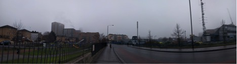

# Measuring Air Quality Through Our Subjective Experience 

#### Ling Tan

What can we do about pollution? It’s such a large issue that we often feel disempowered because it seems like nothing any of us does on our own will have any effect. 

At the beginning of the year, I have been working on an experimental project, WearAQ that looked at how school children could make sense of these complex issue and to consider how people might combine their subjective perception and intuition with wearable technology and machine learning algorithms to investigate air quality issues. I hosted workshops and exploration walks with students at the Marner Primary school in Tower Hamlets London to go out into the surrounding neighbourhood, measure air quality both technologically and through their own perceptions, and recorded their subjective experience using low tech wearable devices that catalogued their gestures. The perceptual data were then used:

+ *Experiment 1:* to contrast and correlate with measurements from mobile pollution monitoring equipment and photos taken by students on their environment during the walk
+ *Experiment 2:* as ground truth data that are compared with predicted perception data created from conducting data science and machine learning experiments by using existing public data sources found on platforms such as London Air Quality Network and OrganiCity Urban Data Observatory to pinpoint specific datasets that could affect the AQ in the identified journeys.

The result of the experiment has been revealing, we were able to obtain an 8/8 correct predictions on students perceptual data based on our machine learning model. We were also able to obtain a 6/8 accuracy when we compared recorded perceptual data with data from the mobile pollution monitoring equipment. We recognised that there was a lack of data, however it was adequate for a first prototype and have proven via this experiment that there is a correlation between perceptual data to actual air quality measurements.This article will focus on the challenges faced and my experience of structuring participation with the students.

I hosted a total of two workshop sessions at Marner primary school in Tower Hamlets London. Each workshop consisted of 10 students age ranging between 8-12 years. The students first went through a short briefing session on the topic, i.e. air quality/pollution, wearable technology and body gesture, they then get fitted with the wearable devices before going on an exploration walk around the school.
Having previously worked on another project in Umbrellium; Cinder which also involves co-design workshops with students aged 10-18 years old, there are certain key challenges to consider when it comes to working with children, such as:
+ Maintaining their attention span: children tend to get distracted easily when they are given a task to do for a long period of time, how do we make sure to keep them excited throughout the workshop?
+ Social learning: children tend to get easily influenced by peers, how do we prevent them from copying each other when they record their subjective experience of air quality through body gesture? 
+ Understanding concept: some concepts might be incomprehensible to children at the moment, how do we then get them to make sense of complex issues such as air quality and pollution?

**Challenge 1: Understanding AQ**

During the briefing session, students were asked to describe what they know about air pollution. To our surprise, most of them were very aware of the issue of air pollution. Many of the students talked about their personal experience with air pollution, having encounter it on an almost everyday basis due to the location of the school; Marner primary school is located in an area where there is a mix of residential blocks and industrial factories. There is a cement factory located less than 100m away from the school and also right across some residential blocks where some of the students from our workshops live in. As a result, trucks were commonly seen passing by the school. As the school is located right next to Blackwall tunnel, the road at the school’s main entrance is often crowded with vehicles passing through to the tunnel. Traffic gets worse during early morning and late afternoon which coincide with school’s opening and closing time. 

When the students were asked about what causes air pollution, most of them replied exhaust from vehicles and smokes from factory chimney.

