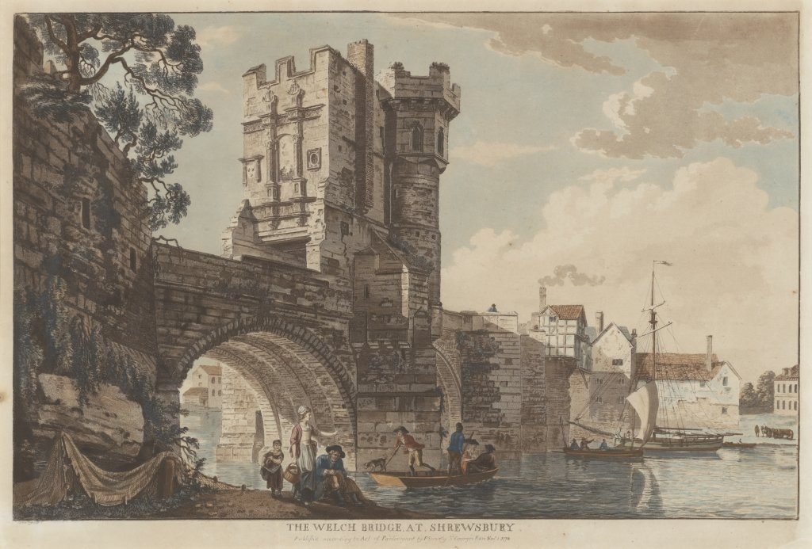

# Making Bridges

#### Andrew Prescott and Jon Rogers

##### Andrew

I’m a medieval historian, and I’m fascinated as to whether there are any lessons from the middle ages which might be relevant to us in our connected digital society. It’s not as unlikely as it seems: Eric Raymond, in his powerful manifesto for open source methods The Cathedral and the Bazaar which was an important influence in the creation of Mozilla, drew a comparison between cathedral building and proprietary software (top down, directed by a few gurus, highly structured, slow) and medieval market places and open source (bottom up, growing haphazardly and organically, non-hierarchical). I’m not completely convinced about Raymond’s analogies - cathedral building was more organic than he suggests and medieval bazaars were more tightly controlled - but it’s a powerful vision and has been a major influence on the open source movement.

But there’s a third medieval achievement that Raymond doesn’t mention and also seems to suggest perspectives on our current concerns, and that is the medieval bridge. David Harrison in his fascinating study of The Bridges of Medieval England: Transport and Society 400-1800 (Oxford, 2004) has shown how one of the amazing achievement of the Anglo-Saxons was to establish the shape of much of the modern road network by about the time of the Norman Conquest. From the eighth century onwards, medieval carpenters and masons put in place the shape of the modern road bridge network, first in wood and afterwards in stone. The medieval network provided the framework for land communication in Britain until the late eighteenth century, when increased traffic and reduced costs led to a second great age of bridge building.

What is fascinating is the way in which the building and maintenance of these bridges was integrated into medieval society. Anglo-Saxon tenants were obliged to help look after the bridges as a condition of their landholding. The church offered remission of sins to anyone leaving money for the upkeep of bridges. Chapels were built on the bridges to encourage bequests and gifts for the bridge. Hermits collected money for the bridge and helped with running repairs. The London Bridge Trust which manages land left in the middle ages for the upkeep of London Bridge is still a very wealthy charity today.

How do we achieve a similar public engagement with our digital infrastructure? The cables and routers that constitute the internet constitute a network which is just as remarkable as the bridge network described by Harrison. But we hear much less about keeping it open than we do about the creation of the software and operating systems which run the computers. Just as bridges were as important as cathedrals and bazaars in the middle ages, so it is just as important that our digital infrastructure is open and that there is a public stake and involvement in it.

We can all contribute to creating open software and content, but how do we contributed to open networks. What is the infrastructural equivalent of the medieval chapel on the bridge, engaging the community in maintaining an open network in which the community has a stake?   

##### Jon

This is fascinating Andrew,  what a wonderful brief history of bridges. I I am always amazed at the way you reach across human history to remind us that as a society we have recurring challenges.  It reminds me of the a famous phrase by another remarkable author of brief histories, Stephen Hawking where he describes the predictability of the universe.  

> “Thus it seems Einstein was doubly wrong when he said, God does not play dice. Not only does God definitely play dice, but He sometimes confuses us by throwing them where they can't be seen.” [^1](#fn1)  Where it seems that despite the laws of physics giving us an indeterministic universe, we seem entirely bereft of these laws as we play out societal behaviour on a human scale, where we choose throw the same numbers time and time again.   

When we think about the bridges that digital infrastructure provides, for me it’s less one of cables and routers, or even of open software movements, and more one of an abstracted bridge between those who are in power and their effect  on human lives.   Because I’m not even sure we know what this looks like. We can very keenly feel the positive effect of communication.  Skyping my father for the first time was a powerful reminder of emotional connections between people that the internet can bring. We were in a log cabin in a trout farm close to the medieval Slovenian town of Kamnic en-route to our camping holiday in Croatia (a location we found on google maps and booked through booking.com); my dad was in his greenhouse and using his new tablet.  He never quite got the usefulness of digital until now, perhaps that’s my fault as the bleeping pixels of my early (and last) attempts at creating video games on my ZX Spectrum in 1983 might have put him off!  Thankfully for him, the science fiction I was reading at the time has become a reality in his lifetime.   I’m not on social media, but the social bridging capacity of Facebook is remarkable. And with new bridges comes new power. I guess that’s obvious in the way that bridge destruction is one of the first acts of warfare. 

With the internet of things, comes a new design in the bridge building between humans and remote control.  I come back to this later in this book in an essay with my colleague, Michelle Thorne in Mozilla’s Open IoT studio, - where we talk about the ways in which IoT is  amplifying the social power of computation at a level I don’t think we’ve seen since the industrial ages.   

So with these new social and economic bridges brought by the IoT, I’m really interested in learning about the economic, social and cultural  power that actual bridges gave in the medieval times. What shifts did they make to previously unconnected places? What impact was this on the people at the receiving end of a new bridge? Was it a celebration at both sides?  Bridge building now seems to be a highly collaborative act. Wall building is the opposite, but was it always that way? As you’ve pointed out Andrew, we need to find ways to have medieval levels of public engagement with our digital infrastructure.  I’m worried that we’ve becoming a society of consumers not of contributors. That there is no public appetite to first of all see  the invisible bridges being built by computation and secondly that if they do that there’s an enormous societal shoulder shrug of “why should we care?”.  After all, in medieval times if a bridge was taken down, then social connections, trade and societal welfare were at stake. Since  Facebook, Google and Amazon are doing such a great job, why should anyone care? 

##### Andrew

A bridge was a very visible expression of a community’s wealth and power. Some of the structures illustrated in David Harrison’s book are amazing. The Dee Bridge in Chester was built in the mid fourteenth century and some of the spans are as big as sixty foot across. The bridge looks asymmetrical, because the stonemasons took care to site the bridge piers on the firmest parts of the river bed. Or there is the Framwellgate bridge in Durham dating from the twelfth century with ninety foot spans. Almost nothing as big was built again until the reign of Queen Victoria. And of course people lived on bridges. There is a terrifying description of the collapse of the 500 year old bridge at Newcastle during floods in 1771, and the families who lived in the houses on the bridge huddling for safety on small slabs of stone on the collapsed piers.

The visibility of medieval bridges was an expression of the way in which they were an integral part of community life. Part of the problem about our modern infrastructure is that it is invisible. We simply switch on our wifi and don’t think much about the cables that cross the Atlantic, the switching stations at Cornwall where the internet comes ashore, the green street cabinets that are necessary for our home internet connections. We think of the cloud as something ineffable and incorporeal, and forget about the huge and environmentally damaging data centres operated by companies like Google and Amazon. So long as we think of the web as an immaterial magic presence, we won’t feel much sense of a bridge with those companies and governments who exercise power through the web. If our engagement with the web is as a dematerialised entity, then kit is not surprising that we start to think it is natural that our guide to the web should be a disembodied voice.

So, I think part of the answer to Jon’s concerns is to make the materiality of the web more visible. We need to think we can take ownership and control of the web, and that’s easier when it looks like something we can control. That’s why I love some of the work Jon and Michelle have done with Mozilla Foundation’s Open IoT studio. During an event in Anstruther in Fife last year, they used IoT methods to turn a redundant phone box into a local community information centre. That’s making the web visible and putting it in the heart of the community, like a medieval bridge. I also love the way that Helen Manchester and the Tangible Memories team at the University of Bristol have been using IoT methods to work with primary school children and the elderly to improve the sense of identity and happiness of those in residential care. By making the IoT as visible in our community as a medieval bridge, we can use it to build bridges between ourselves and to resist corporate brainwashing.

Alexa is not a goddess. She gets her information from us. Look up ‘London Bridge’ on Google - you will see a panel that gives you all the essential data on the bridge, telling you that it is for example 269 metres long and that it is a box girder bridge. This is the sort of information that Alexa and Siri might use in answering your questions. It is derived by Google from resources like Wikidata. But the process of squeezing a lot of information into Wikidata creates distortions. The Google panel states that construction of London Bridge started in 1824, which was when Rennie’s now demolished bridge was begun, not the present bridge, started in 1967.

But we can take ownership of this information. We can suggest a Google edit, and we can edit the Wikidata information. We can help keep the data on the internet in good repair, just as medieval people regarded it as a communal task to keep a bridge in good repair.

Of course, medieval people did not always work on bridges willingly. Bridges are also about power. At the entrance of London Bridge, they used to put the heads of traitors on spikes, a grisly reminder of royal power. It seems that a lot of Anglo-Saxon bridge building was connected with the growth of defensive networks against the Vikings. But there was an engagement between the community and this power, because everyone recognised the value of the bridge. Likewise, we all recognise the value of the internet and we need to act together as a community to keep it healthy. 

##### Jon

I’m glad you mentioned Alexa, because this is where we come to the most powerful bridge of all - the human voice. From before we are born we start to become attuned to the voice of our mother, our neural pathways are being formed so that by the time we reach  early childhood we can all speak our native language.  As Chomsky puts it “it is unimaginable that a highly specific abstract and tightly organised language comes by accident into the mind of every four year old child” [^2](#fn2) . Our use of Mother Tongue  shows the bridge to our closest relationships and our use of language. And now we have highly sophisticated natural language processors that are able to connect us to centralised computation. If we throw in another of Chomsky’s principles, decentralised power: “Classical liberalism—as developed, for example, by Humboldt—or much of Enlightenment thought was opposed to the church and the state and the feudal system, but for a reason: because those were the striking examples of centralized power. What it was really opposed to was centralized power that’s not under popular control. Nineteenth-century corporations are another form of centralized power completely out of public control, and by the same reasoning we should be opposed to them” [^3](#fn3) , then we should be hugely concerned about what the voice can do for bridging between power and computation.  

My view is that the route to understanding power is to reveal it. I was introduced to the serbian media activist Vladan Joler on our first Caravan [^4](#fn4)  event that we ran with Quicksand at the National Institute of Design in India.  The work of his Share Lab [^5](#fn5)  that exposes the true nature of how we are all working for corporations such as facebook and the extent to the power that they have over us. 

Which is why I love that you’re talking about people taking things into their own hands, yet this is a huge task. So few people understand this.  It’s terrifying to see Facebook’s chief lobbyist, Richard Allen,  having such deep and long role in advising UK government policy [^6](#fn6)  and [^7](#fn7) .  We can only hope that the recent appointment of  Nigel Shadbolt, chair of the Open Data Institute, will have a strength of voice to help the UK become a force for an informed, independent and leading role in an alternative narrative to silicon valley.  I think it’s time listened to people such as Bruce Sterling who talk openly about a line in the sand between what Silicon Valley stands for and what a decentralised alternative could stand for [^8](#fn8) . This is something we picked up on with our friends Babitha George and Romit Raj at Quicksand, where we were inspired by their work exploring decentralised ways of working in India.  In their open workbook, Salvage: Decentralising the Internet of Things, they present a series of case studies that show how India has always had a decentralised narrative. At the heart of this is the Gandhian dream that places the welfare of people ahead of centralised profits. For me, the way in which Gandhi re-empowered a nation to otherthrow a brutally oppressive regime (the British)  using a simple homemade spinning wheel is an incredible example of power that comes from decentralised making:  

> “Machinery in the past has made us dependent on England, and the only way we can rid ourselves of the dependence is to boycott all goods made by machinery. This is why we have made it the patriotic duty of every Indian to spin his own cotton and weave his own cloth”. 

The reason why I’m collaborating with Mozilla in forming the Open IoT Studio is that I believe that the narrative towards a decentralised open more human internet is being led through their Internet Health movement.  It’s the start of something that places human value in the web first. For me the framing of the health of a system is a start towards making the invisible bridges much more visible. 

##### Andrew

Which brings us back to the medieval bridges. The eighth and ninth centuries saw the construction of a bridge network whose scale remained unmatched until the growth of the canals and railways. But a lot of that network was the result of local initiative, admittedly encouraged by the crown. It is a big task to confront the power of the giant corporations. Mark Zuckerberg and Jeff Bezos can’t be as easily headed off by legislation as the oil and steel barons of the last century. We need to look to other times and other cultures for inspiration. The kind of exciting creativity we have here at the Digital Design Weekend sums up precisely the spirit we need to keep the internet healthy.

**References:**

<ol>
<li id="fn1">http://www.hawking.org.uk/does-god-play-dice.html<a href="#fnref1">↩</a></li>
<li id="fn2">Chomsky, N. (2009) Language and the Mind, Cambridge University Press 3rd edition <a href="#fnref2">↩</a></li>
<li id="fn3">https://chomsky.info/1991____/ <a href="#fnref3">↩</a></li>
<li id="fn4">https://issuu.com/helloqs/docs/unbox_caravan_v4_web <a href="#fnref4">↩</a></li>
<li id="fn5">https://labs.rs/en/ <a href="#fnref5">↩</a></li>
<li id="fn6">https://www.gov.uk/government/groups/digital-advisory-board <a href="#fnref6">↩</a></li>
<li id="fn7">https://www.gov.uk/government/groups/gds-advisory-board <a href="#fnref7">↩</a></li>
<li id="fn8">https://www.youtube.com/watch?v=6vtwoUugXrQ <a href="#fnref8">↩</a></li>
</ol>
