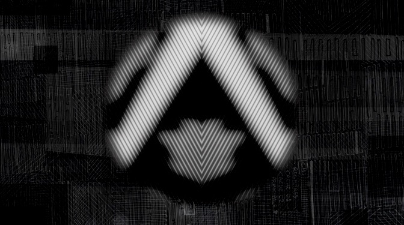
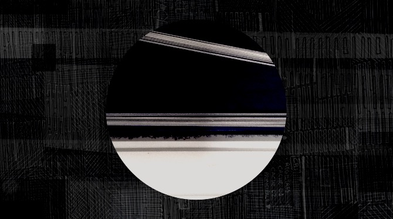
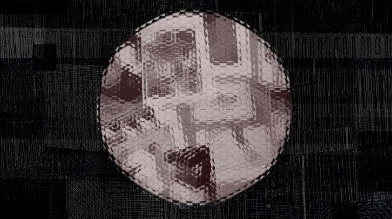
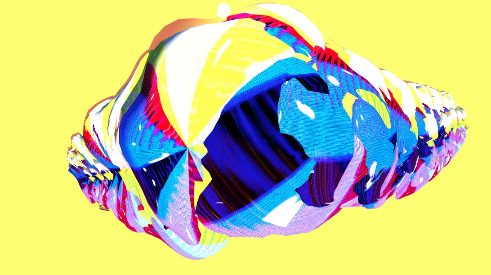
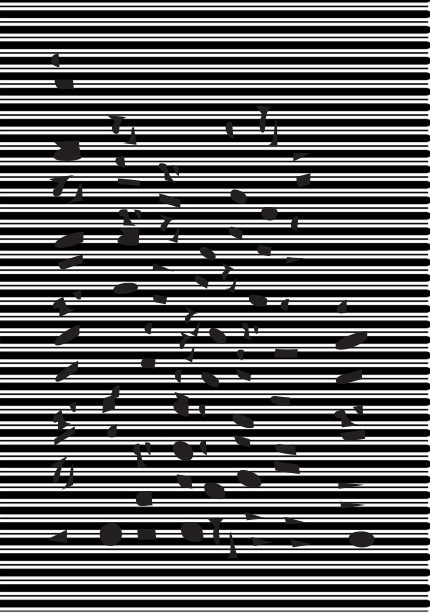

# Art, Design and Neurodiversity

#### Luca M Damiani

**London College of Communication - University of the Arts London**

*My Aspie Hacks the Brain – Luca M Damiani - 2017*

### Introduction

Neurodiversity is a term that embraces many aspects of brain's functions, for example autism, dyslexia, dyspraxia, dyscalculia, Asperger, ADHD. Let's say that it is about the diversity of connections between neurons, which then affects and changes the perception and the interpretation (in different ways and in different degrees) of our surrounding. Being neurodivergent myself (diagnosed with Asperger Syndrome, ASC) and being a practicing artist, I started being particularly interested on the idea of creative development for expanded artistic voice and practice around neurological diversity itself. Within the Art, Design and Neurodiversity project, neurodivergent artists and designers explore their practices in relation to their different forms of neurodiversity. An artistic collective is shaped as a flow of art-practice and social awareness.
In my paper published by the British Computer Society and Computer Arts Society ([Damiani, 2017](http://ewic.bcs.org/upload/pdf/ewic_eva17_nt_paper3.pdf)), there is an academic overview of the topic in relation to the development of this art and design project, so please refer to that for a more in-depth understanding of the overall work. In this short-piece connected to the Digital Design Weekend at V&A, I will share five digital design pieces that were part of the project and exhibition. These design projects represent individual responses that each practitioner had in relation to their own condition. I worked on a digital-art piece based on my aspie-autistic experience; Natasha Trotman worked on a design-tech project interrogating her dyspraxia; Roxanne Bottomley created graphic-posters to represent her dyslexia; John Philip Sage and Jack Warne represented their different ways of having synaesthesia and how they relate to it. Following are the pieces and a brief explanation on both concept and tech used.

### My Aspie Hacks the Brain

*My Aspie Hacks the Brain – Luca M Damiani - 2017*

"My Aspie Hacks the Brain" is a video-art piece and installation that reflects aspects of my individual aspie- autistic experience. First shown at the Science Gallery Dublin in June 2017, this art&design work brings together different factors of the syndrome I experience, considering: control and focus; routine beginning of the day; day-direction and related flow; intense action/work/creation; disturbances that create unfocused moments; time for restructuring the original flow; rhythm/repetition; overwhelming moments due to higher perceptions of surrounding sound/smell/data; tension; privacy; routine of end of day. It is a depiction of moments, where I tried to structure and represent my individual neurological flow in terms of perception, focus, detail thinking and relation with the surrounding. Methods used were illustrated patterns (which I
create daily), photography, 3D, video and coding.

*My Aspie Hacks the Brain – Luca M Damiani – 2017*

### Tune In Tune Out – Dyspraxic Jewellery

*Tune In Tune Out and Dyspraxic Jewellery - Natasha Trotman – 2016*

“Tune In Tune Out” is a toolkit born out of Trotman's project Tangible Linguistics Statistics umbrella project. Focusing on creating an awareness tool, something that allows the users to experience the dyspraxic traits (such as coordination and/or motor difficulties for example), in this project Trotman shapes an intervention to foster empathy, agency and awareness concerning dyspraxia.

> “The Dyspraxic jewellery wearable is a key component of Tune in Tune Out; the jewellery combines traditional crafting and technology to create an experience intervention that explores the textures of dyspraxia, enablling the wearer to have an embodied haptic by amplifying the sensory experience. The haptical wearable highlights some of characteristics of dyspraxia, as experienced by dyspraxics. Participants are tasked with carrying out everyday tasks that dyspraxics contend with, all whilst wearing the dyspraxic Jewellery.” **Artist-Designer: Natasha Trotman**

*Tune In, Fork Design / Dyspraxic Jewellery - Natasha Trotman – 2016*

### Sound Symbolism

*Sound Symbolism - John Philip Sage - 2016*

Synaesthesia is a neurological condition that stimulates simultaneous sensory responses (i.e. connecting hearing to taste to sight for example) and interpretation of data (I.e numbers, words, colours). As per other conditions, every synaethetes is different to others. In Sound Symbolism, designer Sage looks at this from this own experience. 

> “Sound symbolism is the idea that certain vocal sounds carry meaning in and of themselves. This is a project on visualisation of information that explores my own real grapheme-colour synesthesia. I have created a system that transfers my mother tongues (Basque, Spanish and English) into patterns made of shapes and colours, an comparative experiment in phonetics, linguistics and identity; using parameters such as frequency, ordinality, orthographic shape, acoustic perceptive shape, articulatory shape and pitch.” **- Artist-Designer: John Philip Sage**

*Sound Symbolism - John Philip Sage – 2016*

### A Synesthetes Process

*A Synesthetes Process – Jack Warne - 2017*

Continuing on the synaesthesia interpretation, Warne works on a design piece that he describes here.

> “A Synesthetes Process is an on going self-initiated critical design project focused on the phenomenon of Synesthesia. A critical design project communicating the experience of synesthesia to a non-synesthetic audience through digital and analogue methods. The project utilised two hand built visual synthesisers and Cinema4D to create eight audiovisual animations. Each animation represented famous sounds throughout pop culture such as the Wilhelm Scream and the Amen Break. The project aims to educate and fascinate by engaging the audience with the synesthetic depictions, providing an insight into the unseeable world of a synesthetes brain.” **- Artist/Designer: Jack Warne**

*A Synesthetes Process – Jack Warne – 2017*

### Graphic Dyslexia

|  |  |

*Graphic Dyslexia - Roxanne Bottomley – 2016*

Dyslexia is about information processing and this can affect learning and the acquisition of literacy skills. Bottomley reflects here on some aspects of dyslexia from her own experience, creating some graphics to communicate the interpretation and feeling. As she describes: 

> “These posters are a way of visually expressing how dyslexia effects the way I read. I find it difficult to focus on black on a white page and I have difficulties in line tracking. I often focus on the negatives of characters rather than the letters themselves. I therefore drew around the negative space in a sentence taken from my dyslexia report that says: 'A standard score of 63 indicates that her visual processing speed of single word reading is within the very low range.' Once I made the sentence illegible, I manipulated the different backgrounds to emanate the stress my eyes are under when reading. The colour series of these posters was to show what difference adding colour make to someone with dyslexia. I myself have scotopic sight syndrome, which means reading through a coloured lens, or sheet relieves the stress on my eyes.” **– Designer: Roxanne Bottomley**

### Closing

In this brief piece for the V&A Digital Design programme, I wanted to share some of the digital artworks created by neurodivergent practitioners in art and design. This is a small window into the neurodivergent creative practice and into the wider Art, Design and Neurodiversity project, but I hope it gives a sense of the developments considered in our collective practice. Showing how neurodivergent practitioners can create art related to the topic is important for various reasons of artistic and social awareness, working towards a more engaging neurodiverse culture and society.