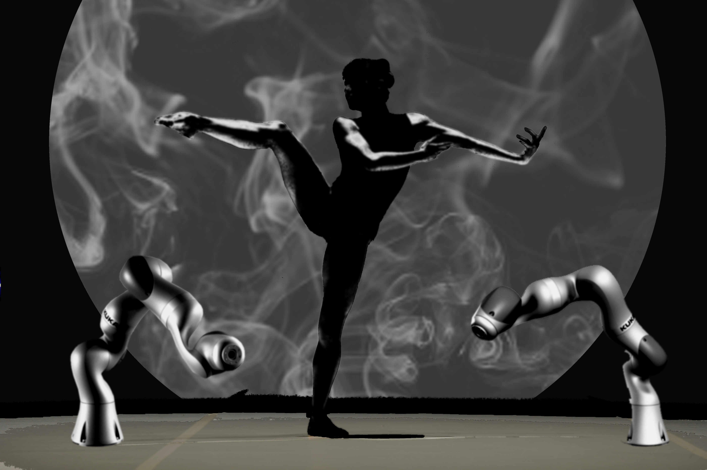

# Slave/Master

### Moin Roberts-Islam

**from Brooke Roberts Innovation Agency**

Watch any present-day science fiction film and if robots feature, they are undoubtedly represented as ominous and unstoppable killers, sinister untrustworthy members of a group who inevitably betray their human companions, or shape-shifting aliens fighting out epic battles in the middle of densely populated urban areas. Gone is the optimistic outlook of the 80’s, with friendly robotic characters like Johnny 5 from “Short Circuit” or “D.A.R.Y.L.”, and instead, the more familiar and enduring depictions of robots are the Schwarzenegger-esque killers from the Terminator quintet, the slippery “synthetic humans” from the Alien films, Blade Runner and ex-Machina, or the huge war- machines from the Transformers films. Little wonder then, that the public’s thoughts around a future encompassing robots and machine learning inevitably go hand in hand with visions of decimation, crushed human skulls and machine overlords.

However, if we take a look at the world around us now, and the machines working alongside humans, we see a very different picture. Medical robots are used to carry out complex and intricate surgical procedures, massively increasing success rates and minimising the number of associated complications. Cars, home appliances and even garments, in some cases, are being manufactured by large automated facilities staffed by robots. Exploration of the far-flung reaches of space and of the depths of the Earth’s oceans is now possible due to robots acting as proxies for human explorers, sending back invaluable data which allows us to learn more about the world and universe around us.

It was with this dichotomy of the perception of robots in mind that we devised our “Slave/Master” installation. We want to explore the borders around human/robot interaction and reverse the traditional “fear” taught to us by cautionary science fiction tales, instead creating a physical dialogue and demonstrating the impact that humans can have on robots' 'behaviour', with the larger aim of challenging the public’s perception of the increased prevalence of robotic technology and making it feel more accessible and less daunting.

Our installation uses collaborative robots, sometimes referred to as cobots, which are able to work alongside human co-workers and can interact with them safely in a common working environment. Having these robots on stage alongside human dancers for our installation demonstrates to the audience that we can co-exist safely within the same environment, and also that it is even possible for us to have a larger effect on the functions and abilities of robots than they might conversely have on us. By working with leading experts from Kuka Robotics UK, Adelphi Automation and SCM Handling and using software from Autodesk, we were able to program our robotic performers to act and re-act in response to the movements of the human dancers on stage with them, all the while maintaining a safe space for all of them to perform in.

The musical score, from composer Rupert Cross, builds slowly through stages of curiosity and exploration, as our human dancers/choreographers, from the London Contemporary Ballet Theatre, move around the performance area, sizing up their robotic counterparts, building and developing to a state of urgency and panic as the humans antagonise and invade the space of the robots, causing them to recoil and avoid in a bid to keep their human peers safe from the recklessness of their own actions.

The performance also uses evolving projected graphics as a window into the “souls” of these robots, with bespoke algorithms and projections from our collaborators, creative digital agency Holition. Using data from the movement and urgency of the robot performers, evolving 3D shapes are formed, with overlaid silhouettes representing memories of past interactions with humans, to portray the robots’ “mood” to the audience via changes in speed, magnitude, texture and colour, ranging from calmly ordered images to more frantic violent forms at the height of the robots’ discomfort. The images are projected onto a screen emerging from an orderly clinical structure, used to represent the robots’ medium of expression to the human audience.

We were delighted to be granted the opportunity to present our work in the awe-inspiring Raphael Gallery, performing among the painted cartoons which gave rise to the hand-woven tapestries in the Sistine Chapel. Raphael’s reputation as one of the most notable draftsmen in the Western world derives from his meticulous preparation and process when creating works of art, laying several of his initial drawings out on the floor and selecting figures from different ones, refining the poses and compositions until he was happy with the result. It is believed that he often created as many as six completely different variants for each scene that he wanted to portray, putting far more of his time into the research and preparation for each artwork than he did for the production of them. And even when he had arrived at a final composition, the fastidious preparation and arrangement continued to be present, as he used faint lines, pin-pricks and indentations to guide his work.

In our preparation for this installation, we have tried to stay true to this level of dedication and preparation, involving and immersing ourselves with every stage of this project and choosing from many different potential expressions of our narrative, from the initial concept and designs, through to programming some of the robots’ movements, the construction of the set and costumes and the organisation and arrangement of all of the component parts and collaborators in the performance space, all the while adhering to meticulously drawn-up plans.

Another important aspect in the work of Raphael was the way that he formulated a refined graphic language to transmit ideas to, influence and elicit an emotional response from his audience. We have again tried to reflect the importance of this in the design of this installation, as the movement of our human dancers directly affects the movements of the robotic performers, which in turn feed and define the projection graphics, which along with the musical score, portray the plight of the robots to the members of the audience and deliver our narrative to them.

**Project team:** Brooke Roberts Innovation Agency (BRIA), Kuka Robotics UK, Holition, Autodesk, London Contemporary Ballet Theatre, Adelphi Automation, SCM Handling, and Rupert Cross