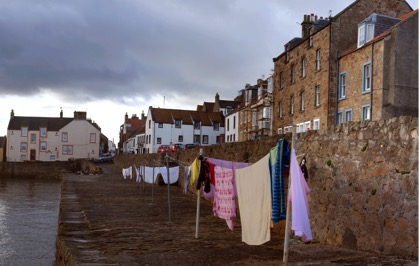

# bridging open borders

_Image: Cellardyke Harbour (Stu Smith)_

When Jon and his family are not in Berlin, working to create an open Internet of Things with the Mozilla Foundation, they live in the town of Anstruther on the coast of Fife. Just up the road from Jon’s house is the old fishing harbour of Cellardyke. Most of the fishermen have now disappeared, but the harbour remains a focal point of local life – a vital public space. The residents still hang their washing out on the harbour walls. On summer evenings, everyone will bring out beer, wine, food, some music, and there will be a spontaneous barbecue and party around the harbour. Anyone who’s around is welcome to drop by and contribute whatever they like to the gathering. 

The Cellardyke barbecues are spontaneous, open and inclusive events, building bridges between neighbours and anyone else who just happens to be around. And that’s the spirit of the Digital Design Weekend at the Victoria and Albert Museum: an opportunity to drop by, see what’s cooking, hear some news, find out what’s exciting or worrying us. And we try to capture something of that in these books. Welcome to our digital barbecue.

We like having such a beautifully designed book by our friends at Uniform because it reflects our interests in artefacts and in the intersection between data and objects. But we also like to explore the possibilities of extending, remixing and interacting with these texts, digitally. We have created this special Github repository where you can learn about previous Digital Design Weekends, contribute your thoughts and suggest some answers to the questions we pose here. 
