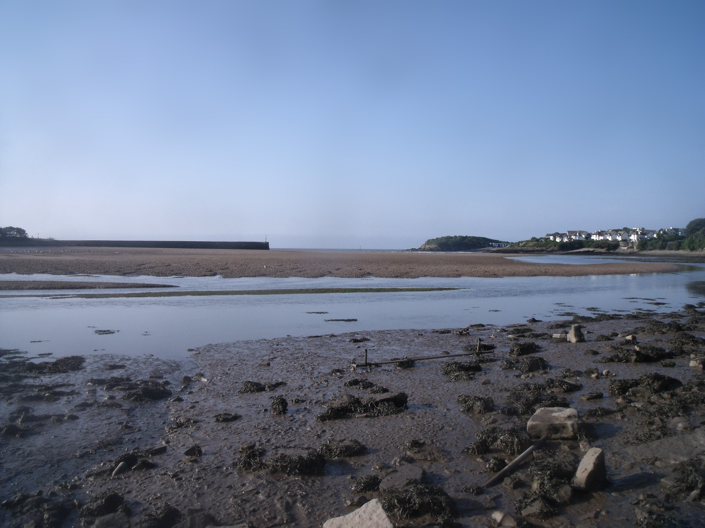
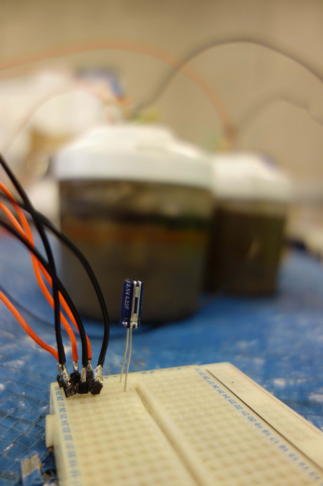

# Power of the mud

#### Paul Granjon

Robotic artist Paul Granjon and bio-engineer Michka Melo are interested in designing and sharing solutions for a sustainable future. Paul's expertise lies in building robots out of e-waste and open source electronics for art and participatory events. Michka is a catalyst who mixes biomimicry expertise with dynamic international networking in the domain of alternative futures and sustainable living. They explore cheap and easy to disseminate sustainable energy systems. Their collaboration is experimental, in a way sometimes described as citizen science. 

Their first collaborative effort aimed at making supercapacitors from domestic materials and used laptop batteries. They managed to produce a weak and unstable capacitor and interesting incidents such as black, smoking acid goo and an improvised microwave autoclave that somehow imploded. Undeterred, they moved on to making microbial fuel cells, a type of bio-batteries that work by harnessing the electron-releasing capability of certain types of bacteria widely found in soil and mud such as geobacter or shewanella.
The work presented for Digital Design Weekend combines an array of clay microbial batteries with a small robotic ecosystem. The batteries use sedimental mud from the Severn Channel and electrodes made of graphite powder and stainless steel scrubbers. A simple electronic circuit collects the electricity produced by the batteries and discharges it intermittently to the robots. The robots use the bursts of energy to get closer and communicate, building overtime a basic shared memory influenced by their interaction and the environment. The robots use Microbits for brains, small yet powerful devices created for teaching kids the joys of physical computing.

Power of the Mud is an experiment designed to both trigger curiosity from various audiences and genuinely explore the potential of home-made microbial fuel cells for powering small domestic or artistic devices. All the work is open source and is partially based on previous experiments, such as the development of the Mudwatt kit, and various open access scientific publications attempting at harnessing the power of the mud. 

Any person who ever made a mud pie will feel comfortable with the technology and the methods. The primal nature of the bacteria, integral living matter in the seemingly inert mud, harks back to the magical life of the golem - a mythological animated humanoid being magically created from mud. The life-giving inscription traced on the golem's forehead is here replaced by a few lines of code written in micro-python, signs that provide simple cybernetic creatures with an evolutive behaviour. Artificial life is brought upon by the **Power of the Mud**.

[https://zprod.org
https://libarynth.org/michka/research/microbial_fuel_cells](https://zprod.org
https://libarynth.org/michka/research/microbial_fuel_cells)