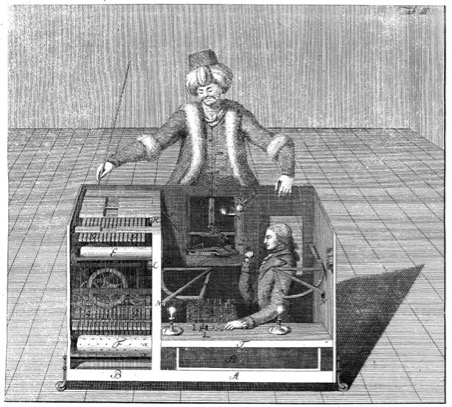

# Making voice visible

## Or why we should investigate the  anatomy of AI and networked devices

#### Vladan Joler

We, as the human particle of networked society, are visible in almost every moment of interaction with technology. We are constantly being tracked, quantified, analysed and commodified. But in contrast to our hyper visibility, many of the phases of birth, life and death of networked devices are covered with a cloak of invisibility. With emerging popular devices relying on a centralised AI infrastructure and invisible interfaces such as voice for example, it seems that the cloak of invisibility is growing even bigger.

We have reached a point where the smooth and shiny aluminium surface of our devices is screwless, without visible entrance, we have lost the keyboards allowing us to code and create new worlds. And now we are losing visible interfaces that will be replaced with voice or gesture interfaces. With the so called “cloud” and machine learning technologies computing and processing does not happen within our devices anymore, but in some big gray building thousands of kilometers away. The actual devices, processing software and algorithms are  somewhere else, or possibly on many places at the same time, but rarely within our reach. What we have for example in devices such as Amazon Echo is just a few sensors and speakers. Not a lot to own on the user’s side, not a lot to open, brake, fix or remix.

**Many layers of invisibility**

As is the case with networked devices we can also speak about various other layers of invisibility:

+ Invisibility of the network infrastructure and the so called cloud infrastructure;
+ Invisibility of the production process, supply chains and materials being used in production;
+ Invisibility of human labour related to many processes in the production of devices;
+ Invisibility of the code hidden behind proprietary software;
+ Invisibility of the overall energy consumption of the whole system.

And many other obvious or more subtle forms of invisibility that we have already related to networked devices. There are some forms of invisibility that are specific and emerging when we speak about voice interfaces as an extension to AI and machine learning infrastructures in comparison to the network infrastructure that we have investigated in our previous work.

On one hand, at the front we have basically invisible interfaces, but then,  deeper at the level of the heart of the process, in the darkness of the neural networks and machine learning, we are seeing new forms of invisibility. Invisibility of the process of machine deduction itself. In previous years in academic, policy and activist circles there was a discourse related to the importance of algorithmic transparency. We can't say that some clear solution emerged from those discussions; and the problem of algorithmic transparency is still very much on the table. But, if we speak about machine learning algorithms, that are responsible for models behind voice interfaces for example, we are facing potentially even deeper problem.

By its nature, deep learning is a particularly dark black box[1](#fn1) and it is hard to believe that we will be able to audit why one neural network deducted something or let say discriminated someone by looking into the hidden layers or nodes of the neural network. Those processes will probably stay hidden within hidden layers of the neural network. This phenomenon has a name: The Black Box of AI. Once one neural network is trained, it is really hard to understand why it gives a particular result to a set of data inputs. This can be a critical point or obstacle in building trust in AI judgment and handful of research institutions and academic researchers are exploring this topic[2](#fn2). 

But probably our attention in the process of revealing layers of invisibility should not be just on the layer of neural networks and deep learning itself but equally on the input layer, or let's say schoolbooks, data sets or feeds of information that one AI reads. It looks like it has never been easier to build AI or machine learning-based systems than it is today. Availability of open-source tools for doing that in combination with easy accessible computation power through cloud oligarchs such as Amazon (AWS) or Google (Google Cloud) is giving a fake idea of accessibility, openness and decentralisation of AI revolution.

We can say that having your own neural network is becoming more and more accessible from the point of setting up your own system, but when it comes to datasets needed for teaching those systems we are facing many new problems. Training datasets became the ultimate resource for development of future machine learning or AI and they are heavily protected behind the proprietary walls of handful of usual suspects. Here we are seeing the same concentration of power accumulated through surveillance economy and massive data hoarding practices in the last decade becoming crucial resource for development of new even more asymmetric power and creation of even bigger gap between the big five and the rest. In their system of immaterial labour exploitation, our new task is to feed their neural networks with our behavioral data, voice, tagged pictures and videos or medical data.

_Lunch atop of Skyscraper. The glass negative of this picture is now owned by Corbis, who acquired it from the Acme Newspictures archive in 1995. The negative at some point long ago was broken into five pieces_

Another interesting angle on this issue is bringing us back to the old but never resolved and slightly forgotten issue of ownership and copyright over content. In 1989, Microsoft’s founder Bill Gates started a company, Interactive Home Systems that would later become Corbis[3](#fn3), one of the “big four” of digital image archives. The collection owned by this company contains the world's biggest archive of historical photos from 19th and beginning of 20th century[4](#fn4). It is not hard to believe that such an  archive, that is essentially a private property, with millions of historical photos can be an interesting dataset for training of future AI. This brings us to the issue of ownership over the archives of digitised media from the past and new forms of power and wealth that can be created on privatised recordings of our history.

Even further, development of AI and big data analysis can create new asymmetrical power  between quantified societies that have developed culture and practice of archiving and quantifying  their heritage, history and present and on the other hand societies and cultures, usually in developing countries, without such practices. This can potentially enhance the gap between the first world and developing world, empower old and create new forms of hegemony and digital imperialism.

The personality  of future AIs will be shaped based on the publically available and proprietary datasets. Oddly enough, two popular publicly available datasets nowadays are a collection of 1495 TED talks audio recordings with full text transcriptions of those recordings and a database of half a million emails that once belonged to senior management of Enron Corporation. Even deep learning does not work exactly that way, I found extremely funny and at the same time frightening to think about artificial person that can combine the personality of Enron manager and “how to save the world” TED-talk-presentation-on-steroids narrative.
 Our potential hypothesis here is that if we are speaking about the transparency of one device or product based on machine learning and neural networks we should ask for transparency of the data sets and feeds that were used in the process of teaching the said network.

It seems that the hardest part of this game is not just massive data collection and ownership over content but tagging and labeling the collected content. This process potentially can reveal another interesting aspect - thousands of hours of hidden low payed human labour.

 In 1770, Wolfgang von Kempelen constructed automaton known as the Mechanical Turk, chess-playing machine with the goal to impress Empress Maria Theresa of Austria. This device was capable of playing chess against a human opponent and had a great success winning most of the games played during its demonstrations around Europe and the Americas for almost nine decades. But, apparently The Mechanical Turk was in fact a mechanical illusion that allowed a human chess master hiding inside to operate the machine.

_https://upload.wikimedia.org/wikipedia/commons/2/22/Tuerkischer_schachspieler_racknitz3.jpg_

Some 160 years later Amazon.com branded its micropayment-based crowdsourcing platform with the same name. According to Ayhan Aytes[5](#fn5), Amazon.com’s initial motivation to build Amazon Mechanical Turk emerged after the failure of its artificial intelligence programs in the task of finding duplicate product pages on its retail website (Pontin, 2007). After a series of futile and expensive attempts, the project engineers turned to humans to work behind computers within a streamlined web-based system.  Amazon Mechanical Turk digital workshop emulates artificial intelligence systems by replacing computing with human brainpower.  As explained by Amazon: With Amazon Mechanical Turk, it may seem to your customers that your application is somehow using advanced artificial intelligence to accomplish tasks, but in reality it is the “Artificial Artificial Intelligence” of the Mechanical Turk workforce that is helping you effectively achieve your business objectives.

As observed by Aytes, In both cases (the Mechanical Turk from 1770 and the contemporary version of Amazon’s service) the performance of the workers who animate the artifice is obscured by the spectacle of the machine.

This kind of invisible, hidden labour, outsourced or crowdsourced, hidden behind interface and camouflaged within algorithmic artificial processes is not so rare especially in the process of tagging and labeling thousands of hours of digital archives for the sake of feeding the neural networks.

The Californian dream of liberated super humans enchanted by AI powers in a global networked society, tends to spot the light and glorify the shiny top of the pyramid, knowledge based aristocracy working in great and shiny corner offices shined by yearlong spring sunlight, ignoring many hidden invisible layers of human labour outsourced and located on the other side of the planet. Writing about the definition of digital labour Christian Fuchs[6](#fn6) is arguing that the creation of digital content (similar can be claimed for the production and maintenance of machine learning and AI systems)  requires a technological infrastructure that is produced and maintained by labour processes that includes diverse activities such as slave-labour extracting minerals that form the physical foundation of information technologies, the labour of militarily controlled and highly exploited hardware assemblers who work under conditions of Taylorist industrialism, a highly paid knowledge labour aristocracy, precarious digital service workers as well as imperialistically exploited knowledge workers in developing countries, workers conducting the industrial recycling and management of e-waste, or highly hazardous informal physical e-waste labour (Fuchs, 2014, 2015)

In order to have complete picture it is important not to neglect the materiality of AI systems and networked devices or what Jussi Parikka will describe as the geology of media. From thousands burning cores of NVidia GPUs within gigantic data centers around the globe to hundreds of thousands of nodes of internet infrastructure needed for transmission, materiality of services such as Amazon Alexa for example is not something that we should forget. Each of those components has its own history starting with millions of years deep time of geological processes followed by dynamic periods of metal extraction from the Earth crust in deep mine holes, traded by the shady guilds  of the metal merchants, millions of kilometers of cargo transportation, complex fractal production chains, sophisticated and long processes of chip production, long assembly lines of Chinese mega factories, and long journeys of international product flows.  

Here invisibility is achieved through the complexity of production process. Fractal supply chains of one sophisticated technological device either one that is hidden within the walls of data centers or the interface in our homes is comprised of thousands of suppliers providing different components that in turn have their own supply chains. The complexity of this system is so vast that the microchip manufacturer Intel[7](#fn7) for example took 2 years to identify whether there is any materials from Congo in their chips. As stated by the researchers from the Oxford Internet Institute in their project Wikichain[8](#fn8). 

“Contemporary capitalism conceals the histories and geographies of most commodities from consumers. Consumers are usually only able to see commodities in the here and now of time and space, and rarely have any opportunities to gaze backwards through the chains of production in order to gain knowledge about the sites of production, transformation, and distribution.”

One can say that there is nothing new compared to the already known discourse on sweatshop practices related to for example shoe or apparel production existing since the early 1970s, or basically any other colonial or neocolonial practice in past centuries. And that is probably true, but one important difference is that production of contemporary technological devices is in most cases much more complex and even more difficult to trace, investigate and audit. -

The proposal here is to try to map and create visual representation, exploded view of deep anatomy of existing devices based on voice interfaces and machine learning technologies, their extended bodies consisted of user interface devices, network topologies, architecture of data centers and core natural language processing and deep learning systems. The idea is to map and potentially spot new black boxes and different forms of invisible surroundings of the development of AI and voice enabled interfaces, so we can try to create new methodologies for future investigations and potential audit of such systems.

**References:**

<ol>
<li id="fn1">https://www.technologyreview.com/s/604087/the-dark-secret-at-the-heart-of-ai/<a href="#fnref1">↩</a>
</li>
<li id="fn2">Such as Jeff Clune at the University of Wyoming and Carlos Guestrin at the University of Washington, Tommi Jaakola and Regina Barzilay at MIT and  Explainable Artificial Intelligence (XAI) at DARPA<a href="#fnref2">↩</a>
</li>
<li id="fn3">Sold in 2016 to Visual China Group<a href="#fnref3">↩</a>
</li>
<li id="fn4">Including most of  iconical photos such as Lunch atop a Skyscraper, photo of Einstein with thong or photos from Tiananmen Square protest<a href="#fnref4">↩</a>
</li>
<li id="fn5">Digital Labour, Chapter 5 : Return of the Crowds<a href="#fnref5">↩</a>
</li>
<li id="fn6">Fuchs, Christian. 2016. Critical Theory of Communication. Pp. 47–73. London: University of Westminster Press. DOI: http://dx.doi.org/10.16997/book1.b. License: CC-BY-NC-ND 4.0<a href="#fnref6">↩</a>
</li>
<li id="fn7">http://www.intel.com/content/www/us/en/corporate-responsibility/conflict-free-minerals.html<a href="#fnref7">↩</a>
</li>
<li id="fn8">https://www.oii.ox.ac.uk/research/projects/wikichains/<a href="#fnref">↩</a>
</li>
