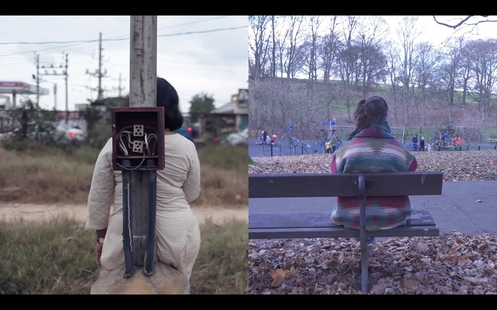

# Duet

#### Babitha George

We started thinking about Duet when Ben (from Invisible Flock) and I met at the UnBox LABS 2014 at NID Ahmedabad. As a multi-disciplinary group, we were exploring the future of cities as human-centred spaces through various projects at the two week lab. In the midst of mobile and web driven ideas, we started talking about how seemingly dated mediums like the SMS probably had a new and increased relevance in today’s times. Smartphones with their surfeit of apps that connect you constantly with the world at large, seemed to leave something wanting. And it almost seemed strange that within a few years, SMS had assumed a nostalgic element that reflected a slower past, one that was slower and more deliberate.
We started talking about the possibility of using SMS as a means to connect people across cultures in a more personal one-to-one fashion, leveraging the minimal text-only nature of SMS to keep these interactions simple, while also allowing for words to reveal intimate details gradually.

Initially titled Kites (as a nod to Uttarayan- the Kite festival in Ahmedabad, which was around when we first began talking about this, as well as building off the idea of random kites flying across to meet and flutter along in the open skies), the project began with some initial explorations around the nature and format of what a participant experience could be. During our first co-working session together in Bangalore, we ran a very informal test session with a few of our friends in India and the UK. This test revealed one of the core aspects of our current experience, the use of facilitated probes over time that would help build a gradual snapshot-based view of oneself as well as a partner. These probes would allow participants a moment in their day when a simple question can make one pause and notice an everyday detail that often goes unnoticed. And be able to see a similar glimpse from an anonymous person in another country.

The journey of creating Duet has been a slow but rewarding one. For a ‘simple’ experience, Duet has taken us close to three years, from when we started talking about it to launching it in 2017 for public download. A large part of this time has been spent in attempting to raise minimal funding for the project. However, what this pace has also allowed us has been multiple opportunities to think through what this experience should be like for our participants and ourselves.

Much gets written about these days that celebrates collaboration, across cultures, across disciplines and across timezones! For us, the journey over the past three years has involved working across two different countries, working closely with a mobile development company and other collaborators, all the while pushing ourselves and others out of our comfort zones, but in a gradual and sensitive way. Collaboration of this sort is often messy and uncertain and runs the risk of leading nowhere. Trust, openness and patience are seen as critical and for good reason. Our experience, both as a group and as creators of a *non-app* has been an illustration of this.

In some sense, the Duet experience of gradually getting to know another person, through a mutually shared and slow process is partially directed. But it also seeks to empower the participants by giving them agency. This mirrors our own collaborative process and journey with creating Duet. It has allowed us to bring our unique strengths into play, while learning from each other without having to rush. Above all, it enabled us to build a deep friendship, which in turn has likely affected the tone and spirit of Duet, as an artistic experiment.

*Photographer: Ed Waring*