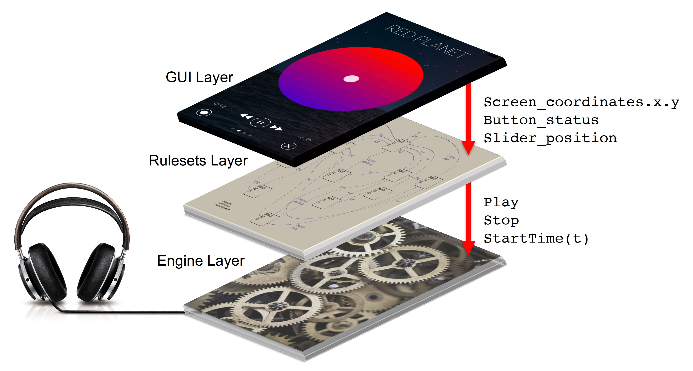

# Get Inside The Music

#### Rob Toulson

Contemporary commercial music is generally created as discrete blocks and layers of digital audio, which can either be recorded or synthesized. Music components are also regularly manipulated in a digital environment to create a larger than life illusion of a band or artist performance. The creation and production of music is therefore a mysterious artistic practice, enabled by digital technologies, but the listener or consumer can have no detailed understanding of this practice from purely experiencing the final music artifact. To build a bridge into the world of music creation, an AHRC funded project, titled Transforming Digital Music, has been conducted to enable listeners to explore the finished music product through a unique interactive app, which empowers the listener to ‘get inside the music’. Collaboration between Professor Rob Toulson (University of Westminster), Professor Justin Paterson (University of West London) and music artist Sarah Kayte Foster of Daisy and The Dark enabled the unique Red Planet EP to be developed and commercially launched as an iPhone/iPad app, alongside standard digital music formats (CD, download and streaming). 

The app allows the listener to change the genre of a given song during playback in a smooth and creative manner. For example, a song with standard pop-rock instrumentation (drums, guitar, synth, strings and vocals) could be manipulated in real-time to play any of a number of styles, e.g. electronic, a cappella group, folk-acoustic, or a blend of those styles. Listeners can also manipulate instrument stems, removing the vocals, isolating the drums, or creating their own preferred mix of the recording. Uniquely, the app also contains other rich media that is not typically available with digital music packages, including artwork, song lyrics, narratives and producer/performer credits. The app also uses ‘Flurry Analytics’ to offer anonymized data to the developers that report user behaviour, yielding qualitative and quantitative knowledge that might assist artists and record companies in developing future marketing and artistic direction.

The Transforming Digital Music project gave a unique opportunity to explore the connection between music artist and fan or listener through an enhanced interactive digital-playback platform. The research project embedded the creative process firmly within the technology realm, and equally saw examples of the new digital platform inspiring and transforming the artistic approach to song writing and music making. A fundamental success of the project was the powerful connectivity between technology developer and creative artist, pushing and pulling the development process and generating a final design that could not have been realised with autonomous creative or technical approaches.

We learnt that Daisy and The Dark, felt more connected to their fan base by allowing listeners to ‘get inside the music’ and explore a wider creative world that the artist wanted to share, in comparison to conventional digital download and music streaming platforms. We learnt that the technology also inspired the artist to explore new creative outputs and music production techniques.

The interactive music app is a disruptive proposition that brings with it a new commercial model, and so has the potential to rejuvenate the revenues of recorded music sales in the future. The project conclusions describe a true ‘digital transformation’ that can bring new creative and commercial benefits to the global music industry. The project has now entered a second stage of development on collaboration with a major international record label, in order to explore wider audience perceptions and connections with commercially released music.

During the Digital Design Weekend Exhibition 2017, the collaborators bring the Transforming Digital Music project to life in a new and extended context. Participants are invited to explore the musical building blocks of Daisy and The Dark’s ground-breaking Red Planet EP, using an interactive display connected to multiple headphone outlets. The artist Daisy and The Dark also gives a number of live ‘silent’ performances that can only be experienced audibly through Bluetooth headphones, enabling participants to experience a unique and immersive musical experience.  

*Example screen images from the Daisy and the Dark Red Planet app.*

*Design architecture for the Daisy and The Dark Red Planet app.*

- Professor Rob Toulson (University of Westminster)
- Professor Justin Paterson (University of West London)
- Sarah Kayte Foster (Daisy and The Dark)