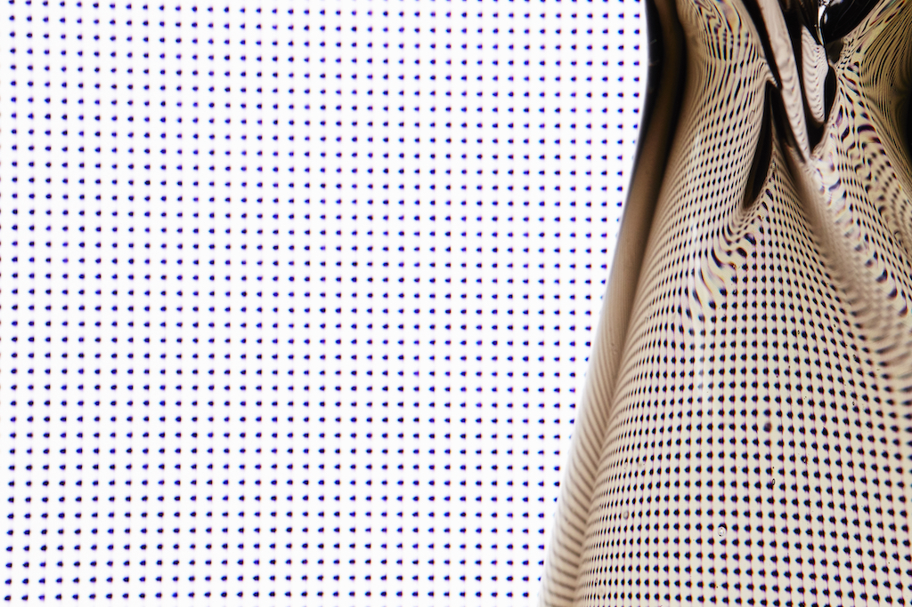

# AUGMENTED MATERI ALITY?
# _______________REALITY?

#### Studio Ini

*Studio Ini and Photographer Luke Walker *

In Studio Ini our augmented reality is a material one; An augmented materiality that wants to address our need for transformation in our physical designed environment....

... a capacity to transform that we are akin to in nature

... a capacity to transform that we are addicted to in our constantly updatable, high speed, heightened, sensorial stimuli from our digital realm.

 ... a capacity to transform that however is still missing in the static 'architecture' of our physical designed world.

In this augmented materiality, we do not seek to augment by superimposing layers of digital media onto static matter. Instead, we seek to supplement our reality by making our physical designs flexible to exist in multiple states, to generate forms based on the context they inhabit and role they will need to perform. We further explore the ability for these physical designs to carry content/information and evolve under changing conditions.

At Studio Ini we therefore seek to develop new platforms of material and structural logic. We further study this matter in the context of human cognition, in how these platforms could change how people create, perceive or act. 

Our material platforms manifest in interactive installation pieces that are exhibited to act as an alternative platform of live experimentation and direct provocation within a human centric feedback loop. In this way, with a multidisciplinary team of designers, engineers and academic affiliates, we practice design as a means to contextualise scientific and empirical research so as to challenge predefined ideals and inspire new perspectives and prototypes of
behaviour.

## An Interview

We asked professionals from different fields to probe us on the motivation of our design
 research and here is how we answer their questions.

### Artist

#### How does augmented materiality differ from augmented reality?

Augmented reality, as commonly defined, focuses on applying layers of intangible digital media onto a static physical reality to create cognitive and sensorial illusions and shape perception. It goes as far as trying to mimic collective sensorial experiences to create the illusion of transformation in the physical world.

Augmented materiality is about crossing the boundaries between digital and physical, not by layering one onto the other but by employing the synergies between them. We see augmented materiality as the ability of the physical world we design to be able to adapt, react and evolve to its environment through embedded logic.

The digital realm becomes the infrastructure that enables such material design.
Computational tools allow us to design the algorithms and simulate how the physical matter will behave and generate form in different contexts. Alongside digital fabrication tools, like
multimaterial 3D printing, which enable continuous composition at high resolution and complex deposition of matter in space to exploit the full spectrum of material transformation and its combinations. [1](#fn1)

### Control Engineer

#### How do you define material logic and what could be new platforms?

We define material logic as the ability to embed within a physical system, rules of behaviour that become intrinsic to the properties of its matter. Material logic must be thought of in conjunction with structural logic, i.e. the architecture in which constituent materials interact in the composite system.

Material & structural logic are and have been the infrastructure of our whole digital world by leveraging the electrochemical properties of semiconductors and the structure in which they are layered to create switches, transistors and processors and in that way build ever more complex logic systems.

However, matter exhibits an abundance of other properties such as the ability to phase change from gas to liquid to solid, malleable to fluid to rigid and to react in exothermic or endothermic reactions when they come together. All these physicochemical or electromechanical properties and properties beyond semiconductor doping, can also work as alternative logic switches.

The increasing resolution of digital fabrication tools (light-based, ink-based and multimaterial additive manufacturing) allow for precise control of how material of different properties interface, to control their reaction and actuation.

Both matter and such tools to compose matter open up platforms for computation to occur in new form factors that can be flexible, transformable and malleable. It is these physical carriers of computational power or information and content that in Studio Ini we seek to research further, discover and construct.

A great example of such logic is the Octobot [2](#fn2) created by Prof. J Lewis and her lab at the Wyss Institute (Harvard University). In this first entirely soft robot, pinch valves are created by microfluidic structures, which allow the full network of chemicals to intermittently react to produce gas resulting in pulsing actuation, all embedded in a soft flexible substrate.

### Journalist, Old & Gas

#### Is perpetual transformation desirable?

Perpetual transformation may neither be desirable nor functional. We do not seek to create an ever engaging or distracting physical environment, in perpetuity.

We explore perpetually changing physical systems to seek out the boundaries of our ability to design for transformation. If we think of our material interfaces as an engineering control
system, we design for equilibrium/ steady states that are dependent on information or matter entering and leaving the system. These distinct steady states achievable through feedback
loops build up the state space of the system, its range of transformation.

In striving towards the design of systems that can perpetually construct and deconstruct themselves we are discovering what elements build up a system that can bring it closer to achieving an extended and adaptable state space.

It challenges us to rethink the use of modules/parts/assemblies that have fixed boundary conditions on their interfaces and limited degrees of freedom in their relative motion. Instead we could consider continuous matter as the building resource, for example composite filament or thread.

### Lawyer

#### How could you design for something that has no final form?

In our opinion, we should strive to design objects with no final form. This allows for resilient approaches to design allowing forms, structures and products to fulfil many divergent needs.

If you observe in nature how things grow: matter and form follow logic. No predetermined final form is set, yet at each point in time the form will be the result of the inherent logic of the system and the interaction with its environment adapting to function in the context that it exists.

Our computational tools allow for performance and environment driven design, they are able to simulate transformable systems in defined contexts and changing conditions. Generative algorithms allow the designer to create a physical system by rules and constraints, allowing the system to self form in multiple ways based on that logic.

The challenge for the designer is to be able to consider their design not as standalone but in conjunction with the context of its environment as a system of object-space, building-nature.
A design made in line with the rules and norms of the system and the environment it can adapt to, evolve in and in return impact. So we must move from thinking about form and volumes, to systems, properties of matter and structure / rules & constraints and feedback loops.

Interestingly non-form driven design brings us closer to craft. The craftsman holds a profound
knowledge of his material and how it can dynamically behave whilst manipulated. The forms
will have to respect the inherent properties and behaviour of the material. At Studio Ini we
design with technology and craft. Our latest research has been working into designing with
glass both by blowing and 3D printing.

====

We would like to leave you with a few questions we here at Studio Ini are currently thinking about and trying to address through some of our research:

- What is the material/physical pixel?
- To what extent should the material world strive to imitate the digital?
- What would be the role of culture in a world that can more easily and dynamically transform?
- Can we reconcile finite resources of the material/physical world with the expectation of infinity in the digital world?
- Could we imagine this transformability as a new approach to sustainability and resilient design?

====

**References:**

<ol>
<li id="fn1">Nassia (founder of Studio Ini) worked on exploring this capability for a year as part of the Mediated Matter Group Glass II, Mediated Matter Group, http://matter.media.mit.edu/environments <a href="#fnref1">↩</a></li>
<li id="fn2">Octobot, Lewis Lab & Wyss Institute, https://wyss.harvard.edu/the-first-autonomous-entirely- soft-robot/ <a href="#fnref2">↩</a></li>
</ol>
